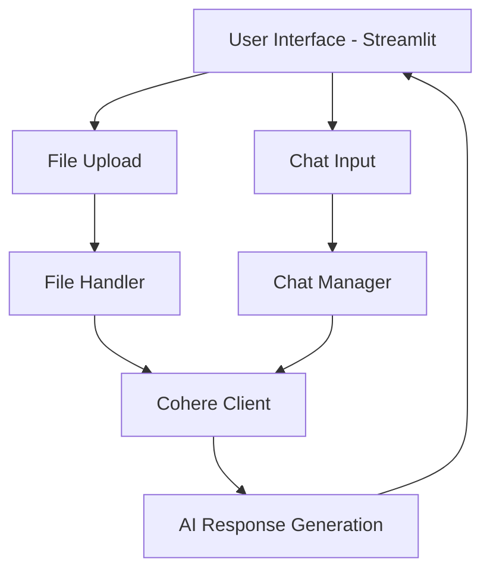

## Project Overview

Chatish is an innovative Streamlit web application that demonstrates the power of contextual retrieval using large language models, specifically Cohere's Command R model. This project showcases how modern AI can transform document interaction through intelligent, context-aware conversations.

## Architectural Components

The application is structured around four primary Python modules:

1. **app.py**: Main application entry point
2. **chat_manager.py**: Manages chat interactions
3. **cohere_client.py**: Handles AI interactions
4. **file_handler.py**: Processes uploaded documents

### Application Architecture Diagram



## Key Implementation Details
### File Handling Strategy
The `FileHandler` class demonstrates a flexible approach to document processing:

```python
def process_file(self, uploaded_file):
    if uploaded_file.type == "application/pdf":
        return self.extract_text_from_pdf(uploaded_file)
    else:
        # Extensible for future file type support
        return uploaded_file.read().decode()
```

### Intelligent Prompt Engineering
The `CohereClient` builds context-aware prompts:

```python
def build_prompt(self, user_input, context=None):
    context_str = f"{context}\n\n" if context else ""
    return (
        f"{context_str}"
        f"Question: {user_input}\n"
        f"Provide straight to the point response except when told "
        f"to elaborate using available metrics and historical data"
    )
```

### Conversation Management
The chat management includes intelligent history tracking:

```python
def chat(self, user_input, context=None):
    # Maintain conversation history
    self.conversation_history.append({"role": "user", "content": user_input})
    
    # Limit history to prevent context overflow
    if len(self.conversation_history) > 10:
        self.conversation_history = self.conversation_history[-10:]
```

## Technical Challenges Addressed

1. **Context Retrieval**: Dynamically incorporating uploaded document context
2. **Conversation Persistence**: Maintaining conversational state
3. **Streaming Response**: Implementing real-time AI response generation

## Technology Stack

- **Web Framework**: Streamlit
- **AI Integration**: Cohere Command R
- **Document Processing**: PyPDF2
- **Language**: Python 3.9+

## Performance Considerations

- **Token Limits**: Configurable with `max_tokens` parameter
- **Temperature Control**: Adjustable response creativity via `temperature`
- **Model Flexibility**: Easy model swapping in configuration

## Future Roadmap

1. Enhanced error handling
2. Support for additional file types
3. Advanced context chunking
4. Sentiment analysis integration

## Deployment Considerations

### Requirements
```
cohere==5.13.11
streamlit==1.41.1
PyPDF2==3.0.1
```

### Quick Start
```bash
# Create virtual environment
python3 -m venv chatish_env

# Activate environment
source chatish_env/bin/activate

# Install dependencies
pip install -r requirements.txt

# Run application
streamlit run app.py
```

## Security and Ethical Considerations

- API key protection
- Explicit user warnings about AI hallucinations
- Transparent context management

## Conclusion

Chatish represents a pragmatic implementation of contextual AI interaction, bridging advanced language models with user-friendly document analysis.

### Key Takeaways
- Modular, extensible architecture
- Intelligent context incorporation
- Streamlined user experience

**Explore, Experiment, Extend!**

[GitHub Repository](https://github.com/AkanimohOD19A/chatish_v1)